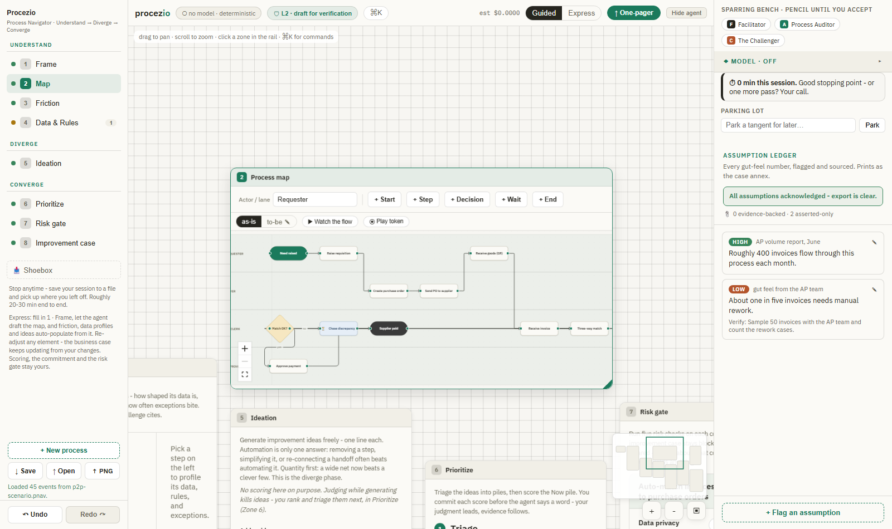
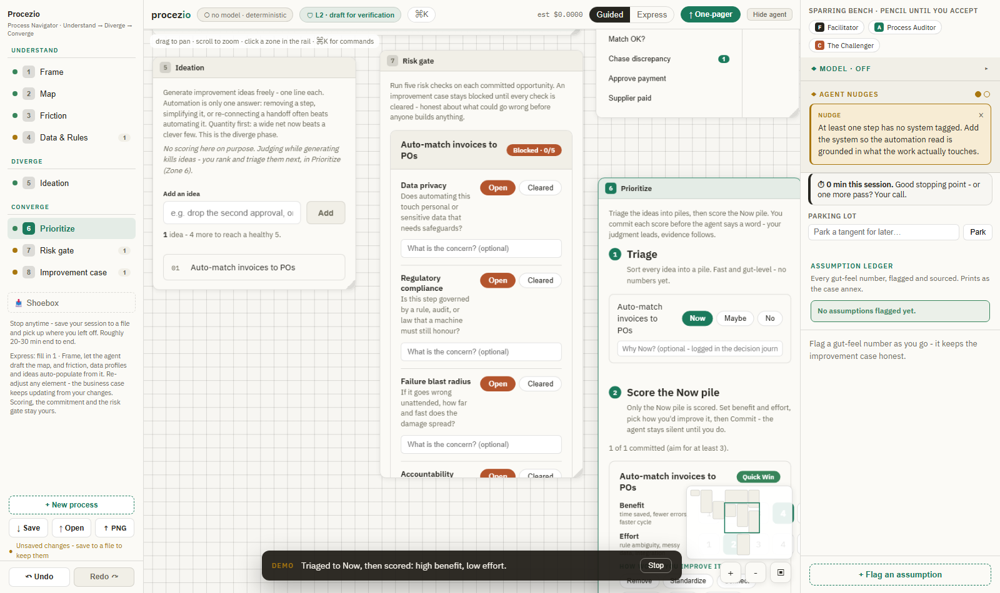
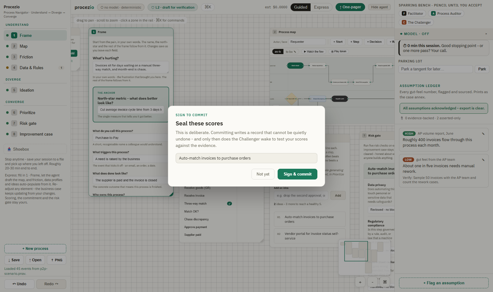
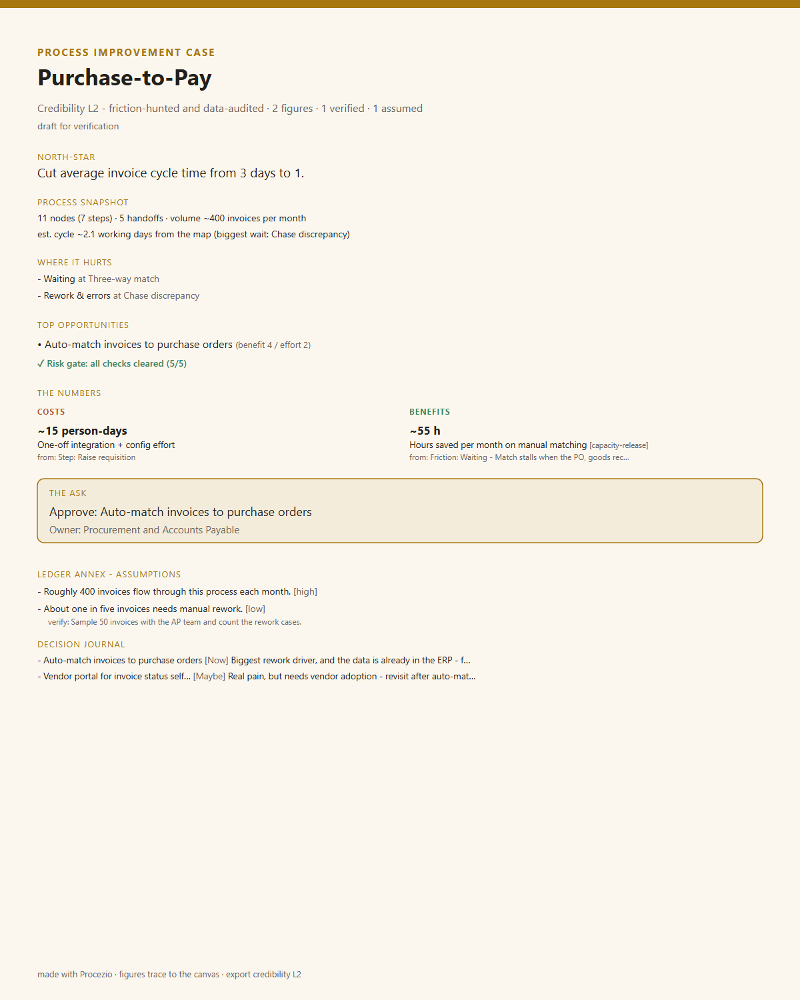

# Procezio - Process Navigator

A guided improvement-opportunity canvas with a co-working AI agent - for supply chain and business professionals who write no code.

[](https://github.com/automatiqa-lab/procezio/actions/workflows/ci.yml)
[](https://github.com/automatiqa-lab/procezio/actions/workflows/e2e.yml)
[](https://github.com/automatiqa-lab/procezio/actions/workflows/codeql.yml)
[](LICENSE)


Describe and draw one process on a fixed 8-zone canvas (Understand → Diverge → Converge). The agent probes gaps, challenges your scores with evidence from your own canvas - only after you commit them - and drafts a risk-gated automation business case where every figure traces to its source. Every agent contribution renders in "pencil" until you accept it.



## What it looks like

The keyless scripted demo plays the whole loop - template map, data pain, an idea, triage and scoring, the signed commitment, the Challenger's evidence-cited probe, the sourced case - in under three minutes, with no key and no model:



Scoring ends at the commit ceremony. Committing writes a record that cannot be quietly undone - and only then does the Challenger wake to test your scores against your own evidence:



The output is a one-pager built around the numbers: costs and benefits with their sources resolved to real canvas elements, a process snapshot with a cycle estimate, the loudest friction, the risk-gate verdict, and the assumption annex with verify plans. Exports as PNG, PDF, or a 16:9 slide - and the session-carrying PNG reopens in Procezio:



## Try it on a real scenario

Three full-loop sessions ship in [`demo/`](demo/) - Purchase-to-Pay, Order-to-Cash, and carrier onboarding - each carried from pain to a sourced, risk-gated case. Open any of them via **Open** in the session bar, or just append `?demo=1` to the URL for the scripted demo. Everything works with no model connected; connect one and the agent trio joins in.

## Runs three ways, one codebase

Isomorphic TypeScript core, built Solo → Collab → Enterprise:

- **Solo** (first release) - entirely in your browser. Sessions are local `.pnav` files; bring your own model (any OpenAI-compatible endpoint, or a local Ollama); works offline and air-gapped. The static-hosted demo *is* the product.
- **Collab** - a minimal self-hosted relay adds real-time co-editing and presence over a share link. No accounts.
- **Enterprise** (later edition) - the same relay with Postgres/RLS, OIDC, RBAC, and an audit sink.

## Quick start (Solo)

Requires Node 20+. The repo uses pnpm via Corepack - no global install needed.

```bash
corepack pnpm install
corepack pnpm --filter @procezio/app run dev      # dev server on http://localhost:5173
```

Build the static bundle (this is the whole product - host the `app/dist` folder anywhere):

```bash
corepack pnpm --filter @procezio/app run build
```

Connect a model in **Settings**: the presets cover local Ollama and LM Studio (no key, fully offline), any OpenAI-compatible endpoint, OpenRouter and Gemini. The shipped CSP deliberately blocks direct cloud calls - self-host with an amended CSP, or put a small reverse proxy in front that injects the key server-side so it never enters the browser.

Run the full definition-of-done gate suite (what CI runs):

```bash
corepack pnpm run ci:all      # typecheck, lint, drift/replay/security/bundle gates, all tests
corepack pnpm run e2e         # Playwright smoke + privacy (installs Chromium once via e2e:install)
```

## Privacy and security

The promise: **your process knowledge never leaves your boundary.** In Solo there is no Procezio server, no account, no telemetry - the app talks only to the model endpoint you configure.

This is enforced, not just asserted: a strict CSP with no `unsafe-eval`, model output treated as data (never executed), the API key never written to a `.pnav`/log/URL, and a loaded session re-validated so provenance can't be forged. A CI gate (`ci:security-solo`) checks the source and an E2E test (`e2e/privacy.spec.ts`) proves the running app makes zero off-origin requests. Dependencies are held to a permissive-license allowlist, scanned (CodeQL, Dependabot), and published as an SBOM.

Full reasoning and honest residual risks: [`docs/THREAT-MODEL.md`](docs/THREAT-MODEL.md) · Reporting: [`SECURITY.md`](SECURITY.md).

## Browser support

Solo targets modern evergreen browsers (Chrome/Edge, Firefox, Safari). One capability degrades gracefully:

| Feature | Chromium (Chrome/Edge) | Firefox / Safari |
| --- | --- | --- |
| Full canvas, agent, `.pnav` save/open | ✅ | ✅ |
| Native file dialogs (File System Access API) | ✅ save-in-place | ⤵ falls back to download / upload |
| OneDrive / SharePoint storage adapter | ✅ | ✅ |

No feature is Chromium-*only*; where the File System Access API is absent, saving downloads a file and opening uses a file picker.

## Status and roadmap

**Pre-1.0, Solo feature-complete.** Specs are ratified through v0.4; the one-canvas build is done and hardened behind the full gate suite: the deterministic core (event store, projections, compensating undo/redo/delete, rule engine, replay determinism), all eight zones on the camera canvas, map-driven autopopulation of friction/data profiles/ideas as reviewable pencil, autosave with restore, the assumption ledger with in-place acknowledgement, the credibility ladder that counts only human-confirmed evidence, live business-case redraft on input changes, and the rebuilt exports. Every claim above is covered by the unit + e2e suites this repo runs in CI.

Next: hardening and the hosted Solo demo → the Collab relay → the Enterprise edition. Pre-1.0 the API and the `.pnav` format may still change between minor versions; see [`CHANGELOG.md`](CHANGELOG.md).

## Governance

Apache-2.0, and meant to stay that way. Development is spec-driven: the ground rules in [`CONTRIBUTING.md`](CONTRIBUTING.md) are binding, changes to ratified artifacts (the schema, rulesets, and prompt packs) go through an amendment PR with a recorded decision, and one task = one bounded card with a CI-enforced definition of done. Contributions welcome - see [`CONTRIBUTING.md`](CONTRIBUTING.md) and [`CODE_OF_CONDUCT.md`](CODE_OF_CONDUCT.md).

**Hard rule:** the LLM never decides *whether* to act - versioned rules decide; the LLM decides how to say it. Deterministic control plane, generative language surface.

## Layout

`core/` `app/` (the implementation) · `schema/` `rulesets/` `prompt-packs/` `templates/` (the methodology as versioned artifacts) · `docs/` (threat model, worked examples) · `demo/` (ready-made scenarios)

---

Procezio - Process Navigator (former working title Opportunity Canvas). Apache-2.0 · Automatiqa Lab by Aleks Sidorecs · <automate@automati.qa> · <https://www.automati.qa/>
